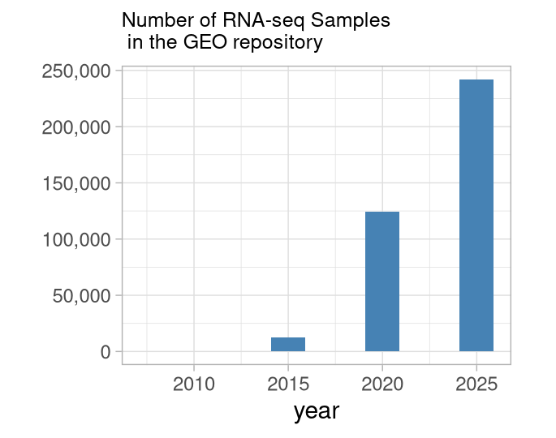

## Differential gene expression analysis of RNA sequencing data

 

The first publications on the topic of "RNA sequencing" appeared in 20081 and
refer to a method in which data is obtained using next generation sequencing
(NGS) technology and processed to obtain RNA reads counts data. These reads are
short nucleotide sequences mapped to a specific genome to find the genes from which they originated; the
reads are also quantified according to gene length2. 

Thus, RNA-seq data represent a matrix in which rows correspond to genes, columns
correspond to samples, and values are reads counts, proportional to genes
expression in samples.

 

The largest public repository of gene expression data,
[GEO](https://www.ncbi.nlm.nih.gov/geo/),
currently stores hundreds of thousands of RNA-seq samples and has been growing
rapidly since 2008.

Differential gene expression (DGE) analysis allows the detection of genes that
are differentially expressed in two or more groups, while accounting for
technical and biological variability across samples3.  

One application of DGE is to identify genes that are misregulated in diseases
such as cancer, which can then be used to diagnose cancer or investigate disease
mechanisms and potential treatments.

In this project, we explore the GSE68086 RNA-seq dataset using unsupervised
machine learning algorithms and find differentially expressed genes using the
DESEq2 package.

### Data

GSE68086 that used for this project is gene expression dataset, and available
from several Internet resources.\
◦ [Expression Omnibus GEO platform](https://www.ncbi.nlm.nih.gov/geo/query/acc.cgi?acc=GSE68086).

◦ The source files used for the project are not included in this repository but
are available on 
[kaggle.com](https://www.kaggle.com/datasets/victorsabanzagil/polymers/data):
[GSE68086_TEP_data_matrix.csv]{.file_name} contains metadata and
[GSE68086_series_matrix.csv]{.file_name} contains RNA-seq read counts.
Both source files were saved as *metadata_raw.rds* and *counts_raw.rds* respectively.

### Files

The project is divided into three parts:

(1) Introduction and data cleaning  
• **scripts/analysis_part1.R**   
  Requires two files with raw data:     
  ◦ **data/counts_raw.rds**   
  ◦ **data/metadata_raw.rds**    

(2) Exploratory data analysis  
• **scripts/analysis_part2.R**   
  Requires the data files that were processed in Part 1:  
  ◦ **data/counts_matrix.rds**   
  ◦ **data/metadata_processed.rds**  
  
(3) Differential gene expression analysis  
• **scripts/analysis_part3.R**    
  Requires the data files that were filtered in Part 2:  
  ◦ **data/counts_filtered.rds**  
  ◦ **data/metadata_filtered.rds**  
  
The Rmd report and its HTML output are based on parts 2 and 3.    

HTML report (output of the *scripts/report.Rmd* file)    
• **index.html**   

Rmd report (it requires files with data: *data/counts_matrix.rds*  and *data/metadata_processed.rds*)     
• **scripts/report.Rmd**   
  Files also required for the Rmd report:     
  ◦ **scripts/styles.css** Styles for HTML report   
  ◦ **scripts/citation_style.csl** Citation styles (from this
[repository](<https://github.com/citation-style-language/styles/blob/master/american-chemical-society.csl>)  )  
  ◦ **scripts/bibliography.bibtex**  Bibliography   

Files with custom functions:   
• **scripts/functions/plot_heatmap.R**  used in    *scripts/analysis_part2.R*  
• **scripts/functions/DEresults.R**   used in *scripts/analysis_part3.R* and *scripts/report.Rmd*

-----------------------------

[1] Wheeler, D., Srinivasan, M., Egholm, M. et al. The complete genome of an
individual by massively parallel DNA sequencing. Nature 452, 872–876 (2008).
https://doi.org/10.1038/nature06884  

[2] Deshpande, D.; Chhugani, K.; Chang, Y.; Karlsberg, A.; Loeffler, C.;
Zhang, J.; Muszyńska, A.; Munteanu, V.; Yang, H.; Rotman, J.; Tao, L.; Balliu, B.;
Tseng, E.; Eskin, E.; Zhao, F.; Mohammadi, P.; P. Łabaj, P.; Mangul, S. 
RNA-Seq Data Science: From Raw Data to Effective Interpretation. Frontiers in
Genetics 2023, Volume 14 - 2023. https://doi.org/10.3389/fgene.2023.997383.  

[3] Mark D. Robinson, Davis J. McCarthy, Gordon K. Smyth, edgeR: a Bioconductor
package for differential expression analysis of digital gene expression data,
Bioinformatics, Volume 26, Issue 1, January 2010, Pages 139–140,
https://doi.org/10.1093/bioinformatics/btp616